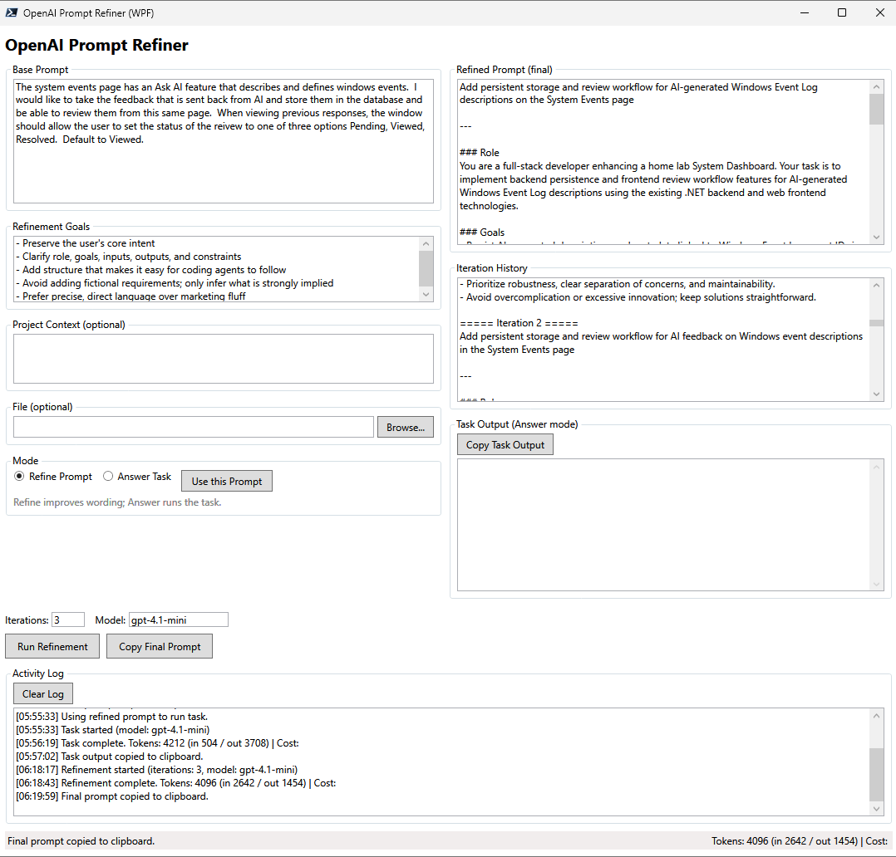

# OpenAI Refiner  

**AI-powered prompt refinement tool with token & cost tracking**

---

OpenAI Refiner is a **PowerShell-based interactive refinement tool** for OpenAI prompts.  

- Iteratively improves prompts with multiple refinement passes  
- Prevents truncation with **dynamic max_token scaling**  
- Saves each iteration in **AI-generated session folders**  
- Tracks **token usage & estimated costs**  
- Logs all sessions into an **Excel summary for long-term cost tracking**  
- Detects when further refinements are **not meaningful** and stops early  

It’s designed for **script developers, documentation writers, and anyone refining complex prompts** while keeping costs transparent.

---

## Screenshot / Example Run

Here’s what a typical refinement session looks like:

- AI-generated folder name  
- Iterations saved as `Iteration_X.txt`  
- Token + cost tracked automatically  
- Session summary logged in Excel  

---

## Output Structure

Each session creates:
/Sessions/
20250727_153045_ShortName_GUI/
Iteration_0.txt
Iteration_1.txt
Iteration_2.txt
...
/Logs/
OpenAI_Refiner.log
OpenAI_SessionSummary.xlsx

- **`Iteration_X.txt`** → Prompt + refined response  
- **`OpenAI_Refiner.log`** → Timestamped log of all operations  
- **`OpenAI_SessionSummary.xlsx`** → Running historical cost + token summary  

---

- **`Iteration_X.txt`** → Prompt + refined response  
- **`OpenAI_Refiner.log`** → Timestamped log of all operations  
- **`OpenAI_SessionSummary.xlsx`** → Running historical cost + token summary  

---

##  Installation

1. **Install PowerShell 7+ (recommended)**  
   Works with Windows PowerShell 5.1, but Core 7+ is preferred.

2. **Install the ImportExcel module (required for Excel tracking)**  
   Install-Module ImportExcel -Scope CurrentUser
   
3. **Set your OpenAI API key**
  $env:OpenAIKey = "your-openai-api-key"

4. **Optional: Set a custom base directory for outputs**
  $env:OpenAI_Refiner_Dir = "C:\AI_Refiner"

5. **Run the script**
  .\OpenAI_Refiner.ps1

***Configuration***
| Setting                   | Description                                      |
| ------------------------- | ------------------------------------------------ |
| `DefaultModel`            | OpenAI model (default: `gpt-4.1-mini`)           |
| `DefaultMaxTokens`        | Base token limit (auto-scales dynamically)       |
| `DefaultTemperature`      | Controls creativity vs. precision                |
| `RefinementIterations`    | Number of refinement passes                      |
| `FolderNameModel`         | Cheap model for AI folder naming (`gpt-4o-mini`) |
| `SessionSummaryFile`      | Excel file for cost tracking                     |
| `RetryCount`              | API retry attempts                               |
| `RetryDelaySeconds`       | Delay between retries                            |
| `RefinementGoalsTemplate` | Default refinement goals if user skips           |

***Example Run***
How can I assist you today? (type 'exit' to quit)
> Generate a PowerShell script that executes an Example Run in a GUI

AI folder name: ExampleRun_GUI
Session outputs will be saved under:
C:\AI_Refiner\Sessions\20250727_153045_ExampleRun_GUI

Enter refinement goals (or press Enter to skip):
> [Press Enter to use defaults]

[2025-07-27 15:30:47] [INFO] Invoking OpenAI API with prompt length: 350 tokens
[2025-07-27 15:30:48] [SUCCESS] Initial GPT Response saved as Iteration_0.txt
[2025-07-27 15:30:55] [INFO] Refinement #1 complete.
...
[2025-07-27 15:31:30] [SUCCESS] Refinement process complete!
[2025-07-27 15:31:30] [SUCCESS] ✅ Total tokens: 4500 (Prompt: 1200 | Completion: 3300)
[2025-07-27 15:31:30] [SUCCESS] ✅ Estimated session cost: $0.024 USD

**Cost Tracking**
Each session logs:
Prompt tokens
Completion tokens
Total tokens
Estimated session cost

It automatically appends a record into:

OpenAI_SessionSummary.xlsx
Example Excel Output:

Date	SessionFolder	Model	IterationsRun	PromptTokens	CompletionTokens	TotalTokens	CostUSD
2025-07-27 15:30	20250727_153045_GenesysLogin_GUI	gpt-4.1-mini	5	1200	3300	4500	0.024
2025-07-27 16:10	20250727_161012_PythonHello	gpt-4.1-mini	1	300	200	500	0.003

**Roadmap**
 Auto-detect truncation → ask GPT to continue from where it left off

 GUI version (WinForms or WPF) for easier usage

 Batch prompt refinement mode

 Multi-model cost comparisons

 Pull live OpenAI billing usage via API

**Security Notes**
Your OpenAI API key is only read from the environment (env:OpenAIKey) and never written to disk.
Session folders only store your prompts & responses, no API keys or secrets.

**Contributing**
Pull requests welcome!
Improve AI folder naming
Add new output formats
Enhance cost tracking

   
