# Prompt Pilot

[](#getting-started)
[](#tech-stack)
[](#tech-stack)
[](#provider-configuration)
[](#provider-configuration)
[](#provider-configuration)

Prompt Pilot is a Windows desktop app for turning rough AI prompts into structured task briefs, then optionally running those prompts against a supported model provider from the same UI.



> 30-second looping demo · [interactive HTML walkthrough](docs/demo/demo.html) · [step-by-step workflow guide](docs/demo/workflow.md)


## Why this repo exists

Prompt Pilot is built for engineers who want a lightweight local tool to:

- refine vague requests into clearer, more actionable prompts
- preserve project-specific context while refining
- compare or switch between supported AI providers
- execute the final prompt without leaving the app

## Actual feature set

### Refine mode

- Iteratively improves a rough prompt over multiple passes
- Produces a structured final prompt with role, goals, context, deliverables, and constraints
- Shows iteration history while the run progresses
- Lets you accept the current draft before all iterations finish
- Estimates token usage and cost before higher-cost runs

### Answer mode

- Sends the current prompt directly to the active provider
- Runs task execution in the background to keep the UI responsive
- Shows task output, token usage, and estimated cost
- Lets you promote a refined prompt straight into task execution

### Provider and settings support

- Supports OpenAI, Anthropic, and GitHub Copilot-compatible endpoints
- Stores provider-specific model and token pricing settings
- Resolves credentials in this order:
  1. session key entered in the app
  2. saved key in `%AppData%\Prompt Pilot\settings.json`
  3. provider environment variable
  4. runtime prompt for a session-only key
- Protects saved keys with `ConvertFrom-SecureString` for the current Windows user

### Workflow helpers

- Save and load prompt presets as JSON
- Optional project context and file path reference
- Optional activity logging to a `.log` file
- Clipboard actions for final prompts and task output

## Current limitations

- Windows only (`WPF` is required)
- The optional file input references a local file path; it does **not** upload file contents
- Portable packaging depends on `ps2exe` and must be built on Windows

## Getting Started

### Prerequisites

- Windows
- Windows PowerShell 5.1 or PowerShell 7+
- At least one provider API key:
  - `OPENAI_API_KEY`
  - `ANTHROPIC_API_KEY`
  - `GITHUB_COPILOT_API_KEY` or `GITHUB_TOKEN`

### Run from source

From the repository root:

```powershell
powershell.exe -NoProfile -Sta -File .\Prompt_Pilot.Wpf.ps1
```

or:

```powershell
pwsh -NoProfile -Sta -File .\Prompt_Pilot.Wpf.ps1
```

### First-run workflow

1. Launch the app.
2. Open **Settings → Configure API Key...**
3. Pick a provider and optionally update its model and token pricing.
4. Save a key for the current Windows user, or rely on environment variables.
5. Enter a base prompt and choose either:
   - **Refine Prompt** to improve the instruction, or
   - **Answer Task** to run it directly.

## Provider configuration

Prompt Pilot keeps provider settings per provider, not globally.

| Provider | Default model | Environment variables |
| --- | --- | --- |
| OpenAI | `gpt-5-mini` | `OPENAI_API_KEY` |
| Anthropic | `claude-sonnet-4-20250514` | `ANTHROPIC_API_KEY` |
| GitHub Copilot | `gpt-4.1` | `GITHUB_COPILOT_API_KEY`, `GITHUB_TOKEN` |

## Build a portable package

The repository includes a packaging script for a portable Windows distribution.

```powershell
.\tools\Build-PortableExe.ps1
```

Default output:

```text
dist\Prompt_Pilot\
  Prompt_Pilot.exe
  Prompt_Pilot.MainWindow.xaml
  package.json
```

Optional example:

```powershell
.\tools\Build-PortableExe.ps1 -OutputBaseName Prompt_Pilot_Beta -ProductName 'Prompt Pilot Beta'
```

If `ps2exe` is not installed:

```powershell
Install-Module ps2exe -Scope CurrentUser
```

## Repository structure

```text
PromptPilot/
├─ Prompt_Pilot.Wpf.ps1          # Main WPF application entrypoint and logic
├─ Prompt_Pilot.MainWindow.xaml  # Main window layout
├─ assets/                       # App icon and branding assets
├─ docs/
│  ├─ example-session.png        # Static screenshot
│  └─ demo/
│     ├─ demo.svg                # Animated workflow demo (embedded in README)
│     ├─ demo.html               # Interactive HTML walkthrough (open locally)
│     ├─ workflow.md             # Step-by-step workflow guide
│     └─ README.md              # Demo assets index
├─ legacy/                       # Older console-based scripts kept for reference
└─ tools/
   ├─ Build-PortableExe.ps1      # Portable packaging script
   └─ Build-AppIcon.ps1          # Icon generation helper
```

## Tech stack

- PowerShell
- WPF / XAML
- REST APIs for OpenAI-compatible and Anthropic-compatible chat providers
- `ps2exe` for portable Windows packaging

## Security notes

- No provider API keys are hardcoded in the repository
- Session keys stay in memory only
- Saved keys are scoped to the current Windows user profile
- Logs avoid writing API key values

## Validation status

Current repository validation used for this documentation refresh:

- `Prompt_Pilot.Wpf.ps1` PowerShell parse: OK
- `tools/Build-PortableExe.ps1` PowerShell parse: OK
- `Prompt_Pilot.MainWindow.xaml` XML parse: OK
